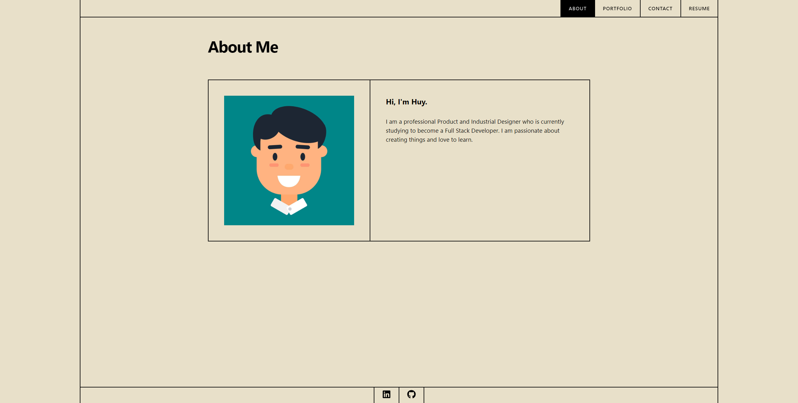
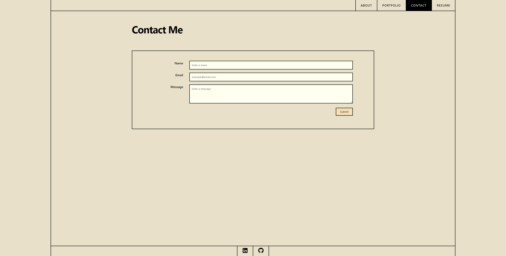
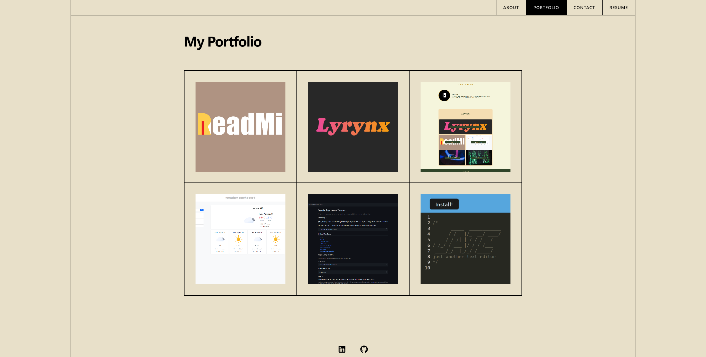
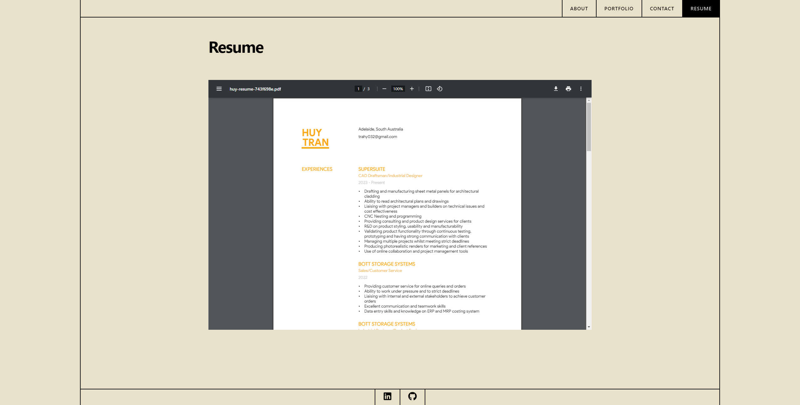

# my-react-portfolio

## Description

My online portfolio created using React and Vanilla CSS which showcases some of my latest projects and includes my resume.

## Table of Contents

- [Installation](#installation)
- [Usage](#usage)
- [Screenshot](#screenshot)
- [Resources](#resources)
- [License](#license)

## Installation

This application can be run through the browser using the provided link down below. Alternatively, the application can be run locally using the following instrctions:

1. Download or clone this repository
2. [node.js](https://nodejs.org/en) is required for this application
3. `npm i` in the terminal to install the required npm packages
4. `npm run start` to invoke the application
5. Use the following link to run the application: http://localhost:3000/

## Usage

Acess the application using the following deployed [LINK](https://aquamarine-hotteok-1830f1.netlify.app/).

Please have a look at my portfolio and reach out if you want to conenect!

## Screenshot

This is the general setup when opening the application.

**About Page**

**Portfolio Page**

**Contact Page**

**Resume Page**

## Resources

- [How To Create A Navbar In React With Routing](https://www.youtube.com/watch?v=SLfhMt5OUPI)

- [Button Hover Bottom To Top](https://stackoverflow.com/questions/56632856/on-hover-fill-button-background-from-bottom-to-top-and-text-color-from-bottom-to)

- [Slide In Overlay From Top](https://www.w3schools.com/css/tryit.asp?filename=trycss_css_image_overlay_slidetop)

- [CSS Grid Layout](https://codepen.io/mary_pieroszkiewicz/pen/owGzBz)

 

**NPM Packages**

- [React Router](https://reactrouter.com/en/main)

- [React Icons](https://react-icons.github.io/react-icons/)

- [React pdfobject](https://www.npmjs.com/package/react-pdfobject)

## License

Please refer to the LICENSE in the repo.

---

[Back To Top](#my-react-portfolio)